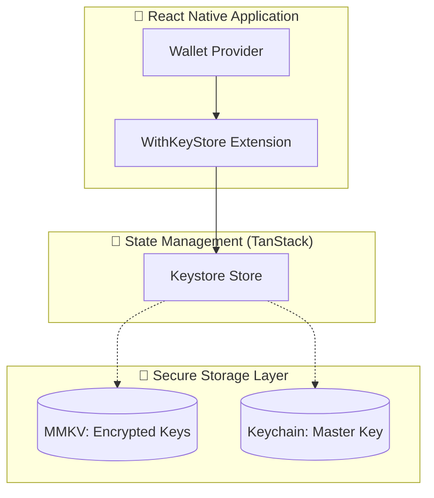

# Keystore Extension Architecture

## Overview

The Keystore Extension provides a standard, secure interface for managing cryptographic keys and HD (Hierarchical Deterministic) wallets. It abstracts away the complexity of key storage, derivation, and cryptographic operations while allowing concrete implementations to fulfill the Keystore contract in different contexts (e.g., React Native, Browser Extensions).

### What is an HD Wallet?

Think of an HD Wallet like a master key system for a large building:

- **The Master Seed**: A single root key (usually represented as a 12-24 word mnemonic phrase) that generates all other keys.
- **Hierarchical Structure**: Keys are organized in a tree structure (like floors and rooms in a building), following paths like `m/44'/283'/0'/0/0`.
- **Deterministic**: Given the same seed and path, you always get the same key. This means:
  - Backup is just the seed phrase
  - Keys can be regenerated on any device
  - No need to manage hundreds of individual key files

**Real-world analogy**: It's like having one master password that generates unique, secure passwords for every website you use, but you only need to remember the master.

## React Native Implementation

The `@wjbeau/react-native-keystore` package provides a specialized implementation of the Keystore Extension optimized for React Native. It uses `react-native-mmkv` for fast, persistent storage of encrypted key material and `react-native-keychain` for secure storage of the master encryption key, ensuring that all data at rest is protected by the platform's secure enclave or keychain.

### Architecture Overview



### Key Components

1.  **Wallet Provider Extension (`WithKeyStore`)**: Integrates the keystore into the Algorand Wallet Provider, exposing the `keystore` API.
2.  **Keystore Store**: A TanStack store that manages the reactive state of the keystore (list of keys, current status).
3.  **MMKV Storage**: Used for persisting encrypted key material (including seeds and private keys). Data is encrypted using AES-256-GCM before being saved to MMKV.
4.  **Keychain Storage**: Uses `react-native-keychain` to securely store the master encryption key. On iOS/Android, this typically leverages hardware-backed security (Secure Enclave/Keystore).

### Bootstrapping Flow

When the application starts, it performs a **bootstrap** process to restore the keystore state:

1.  Retrieve the master encryption key from **Keychain**.
2.  Read all encrypted key data from **MMKV**.
3.  Decrypt the data using the master key.
4.  Initialize the Keystore Store with the decrypted metadata (ensuring private keys are cleared from memory after initialization).
5.  Encrypted key material remains in MMKV and is only decrypted into memory temporarily during cryptographic operations.

## Core Architecture

The keystore follows a **concrete implementation** strategy where all operations and storage are handled directly within the extension.

### Key Segregation

While all data is currently stored in a single persistent mechanism (MMKV), the architecture is designed to eventually segregate concerns:

- **Seeds**: The master HD seeds (highest security requirements).
- **Derived Keys**: Individual keys derived from seeds (medium security).
- **Metadata**: Public information about keys (status, algorithm, etc.).

In the current React Native implementation, all three are stored together in **MMKV**, encrypted at rest with a **Keychain-backed master key**.

## Cryptographic Operations

The keystore is organized for clarity and performance within React Native:

```
src/
├── index.ts              # Main entry point - exports all modules
├── extension.ts          # Wallet Provider extension implementation
├── store.ts              # Business logic for key management and store updates
├── errors.ts             # Custom error classes
├── storage/              # Persistent storage layer
│   ├── index.ts          # Storage exports
│   ├── crypto.ts         # Encryption/Decryption logic (AES-GCM + Keychain)
│   └── state.ts          # MMKV storage interactions and bootstrapping
└── libs.ts               # Cryptographic library wrappers (xhd, dp256)
```

**Key Principles:**

- **Encapsulated Storage**: Persistent storage details are hidden from the extension API.
- **Reactive State**: The TanStack store provides a reactive view of the keystore (metadata only).
- **Ephemeral Secrets**: Private keys are only decrypted into memory when needed and cleared immediately after.

## Core Components

### 1. KeyStore Extension (`extension.ts`)

The `WithKeyStore` extension provides the primary API used by the Wallet Provider. It maps the high-level `KeyStoreAPI` to concrete implementations that handle storage and crypto operations.

### 2. Storage Layer (`storage/`)

This extension uses a **concrete storage mechanism** instead of an abstract wrapper:

- **MMKV**: Used for all persistent data (seeds, keys, and metadata).
- **Keychain**: Used exclusively to protect the **master encryption key**.
- **AES-256-GCM**: The encryption standard used for all data stored in MMKV.

### 3. Cryptographic Libraries (`libs.ts`)

The extension leverages specialized libraries for Algorand-specific operations:

- **XHD**: Implements BIP32-Ed25519 for Algorand.
- **DP256**: Handles deterministic P-256 derivation for Passkeys.

## Security Properties

### Private Keys

- ✅ **Never exported** from the keystore.
- ✅ **Never exposed** to the wallet UI or React state.
- ✅ **Always encrypted at rest** (Stored in MMKV, encrypted with Keychain-backed master key).
- ✅ **Isolated** per derivation path (multi-account support).

### Seeds (BIP39)

- ✅ **Never exported** after import.
- ✅ **Never shared** with wallet UI.
- ✅ **Derivation happens inside** the secure storage layer.
- ✅ **Child keys are isolated** — deriving Account 0 doesn't expose the seed.

## Memory Management

The extension includes automatic memory clearing for sensitive data:

1. **Private keys are cleared after use**: When signing or deriving, private keys are cleared from memory immediately after the operation using `clearBuffer`.
2. **Temporary buffers are zeroed**: All intermediate cryptographic buffers are cleared to prevent leakage in memory dumps.

See [BOOTSTRAPPING.md](./BOOTSTRAPPING.md) for integration guides.
