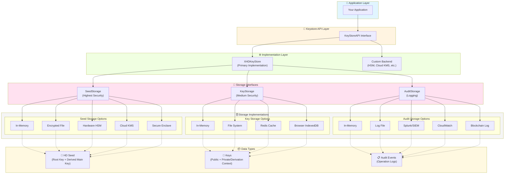
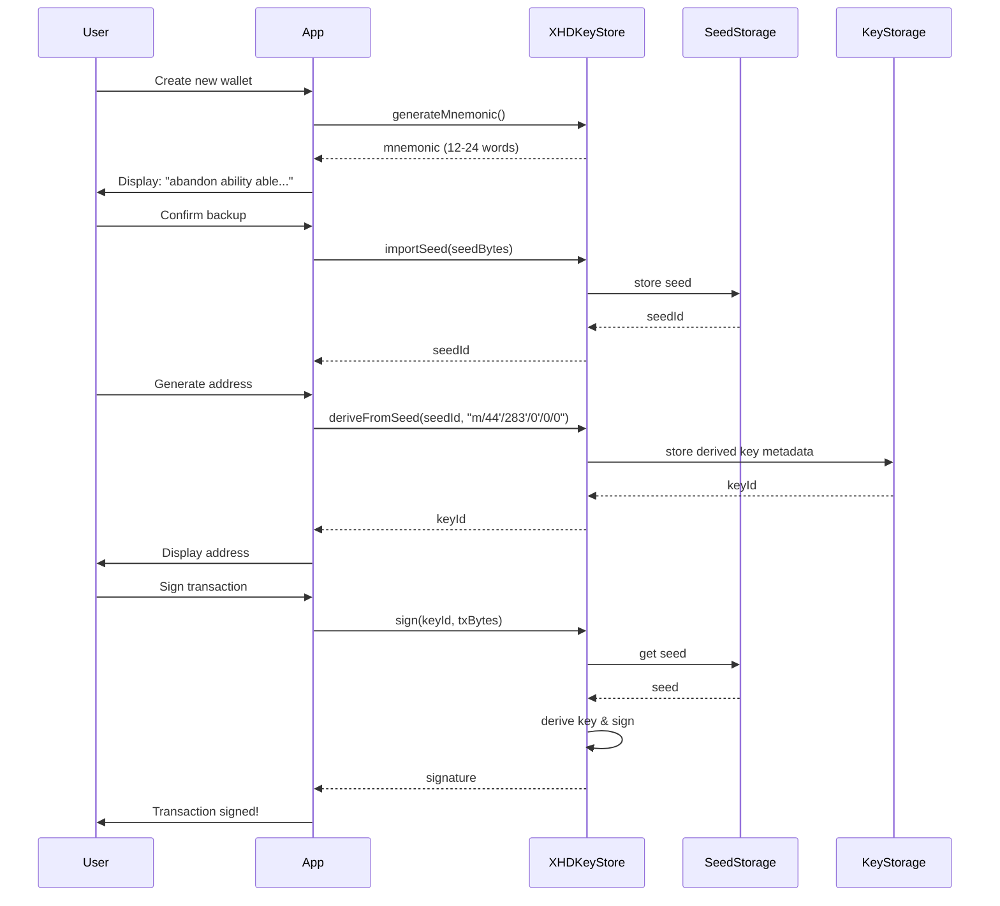
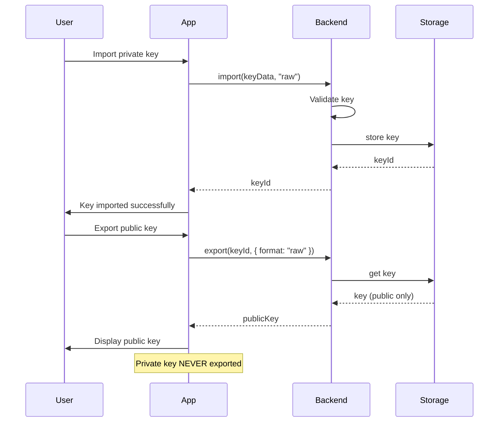
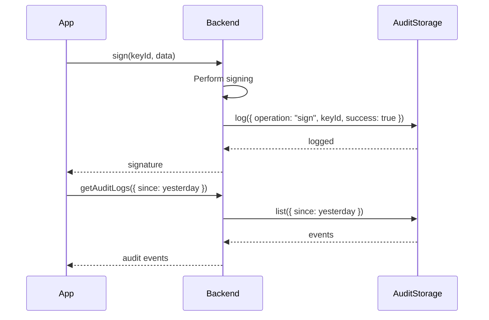

# Keystore Extension Architecture

## Overview

The Keystore Extension provides a secure, pluggable interface for managing cryptographic keys and HD (Hierarchical Deterministic) wallets. It abstracts away the complexity of key storage, derivation, and cryptographic operations while giving integrators full control over how and where sensitive data is stored.

### What is an HD Wallet?

Think of an HD Wallet like a master key system for a large building:

- **The Master Seed**: A single root key (usually represented as a 12-24 word mnemonic phrase) that generates all other keys.
- **Hierarchical Structure**: Keys are organized in a tree structure (like floors and rooms in a building), following paths like `m/44'/283'/0'/0/0`.
- **Deterministic**: Given the same seed and path, you always get the same key. This means:
  - Backup is just the seed phrase
  - Keys can be regenerated on any device
  - No need to manage hundreds of individual key files

**Real-world analogy**: It's like having one master password that generates unique, secure passwords for every website you use, but you only need to remember the master.

## Overall Architecture



### Architecture Flow

1. **Application Layer**: Your application interacts with the `KeyStoreAPI` interface
2. **Implementation Layer**: `XHDKeyStore` provides the main HD wallet functionality, but you can swap in custom implementations (e.g., hardware wallets)
3. **Storage Abstraction**: Three storage interfaces segregate data by sensitivity:
   - **SeedStorage**: Master seeds (highest security requirements)
   - **KeyStorage**: Derived/imported keys (medium security)
   - **AuditStorage**: Operation logs (compliance/debugging)
4. **Pluggable Backends**: Each storage interface can use different implementations based on your security/performance needs
5. **Data Segregation**: Different types of data flow to their respective storage backends

### Security Zones

The architecture supports a **defense-in-depth** approach where you can assign different security levels to different data types:

```
┌─────────────────────────────────────────────────────────────┐
│                    SECURITY ZONES                           │
├─────────────────────────────────────────────────────────────┤
│ 🔴 CRITICAL: Seeds (SeedStorage)                            │
│    • Hardware Security Modules (HSM)                       │
│    • Secure Enclaves (TEE)                                 │
│    • Encrypted offline storage                             │
├─────────────────────────────────────────────────────────────┤
│ 🟡 SENSITIVE: Keys (KeyStorage)                             │
│    • Encrypted file systems                                │
│    • Redis with persistence                                │
│    • Browser IndexedDB                                     │
├─────────────────────────────────────────────────────────────┤
│ 🟢 STANDARD: Audit Logs (AuditStorage)                      │
│    • Log files                                             │
│    • SIEM systems (Splunk)                                 │
│    • Cloud logging (CloudWatch)                            │
│    • Blockchain (tamper-proof)                             │
└─────────────────────────────────────────────────────────────┘
```

## Secure Storage with Wrapping Layer

The keystore now includes a **wrapping layer** architecture that separates:
1. **Where** data is stored (storage backend - PostgreSQL, Filesystem, etc.)
2. **How** data is encrypted (wrapper - AES-GCM, ChaCha20, platform keystore, etc.)

This gives integrators full control over both storage location and encryption method.

### Why a Wrapping Layer?

Traditional encrypted storage mixes both concerns in one class:
```typescript
// OLD: Storage and encryption mixed together
class EncryptedPostgresStorage implements KeyStorage {
  // Handles SQL queries AND encryption logic
}
```

With the wrapping layer, these are separate composable components:
```typescript
// NEW: Separate WHERE from HOW
const postgres = new PostgresRawStorage();     // WHERE
const aesWrapper = new AESGCMKeyWrapper();      // HOW
const secureStorage = new WrappedKeyStorage(postgres, aesWrapper);
```

Benefits:
- **Mix and match**: Any storage + any wrapper
- **Testable**: Test storage and encryption independently
- **Flexible**: Swap encryption without changing storage code
- **Composible**: Chain wrappers (compress → encrypt → store)

### Architecture Overview

```
┌──────────────────────────────────────────────────────────────┐
│                    WRAPPING ARCHITECTURE                      │
├──────────────────────────────────────────────────────────────┤
│                                                               │
│  Application                                                  │
│      │                                                        │
│      ▼                                                        │
│  ┌─────────────┐    ┌──────────────┐    ┌──────────────────┐ │
│  │   Backend   │───▶│   Storage    │◀───│   Raw Storage    │ │
│  │             │    │   Wrapper    │    │   (PostgreSQL,   │ │
│  │XHDKeyStore  │    │              │    │   Filesystem,    │ │
│  │  Backend    │    │  WrappedKey  │    │   Redis, etc.)   │ │
│  │             │    │   Storage    │    │                  │ │
│  └─────────────┘    └──────────────┘    └──────────────────┘ │
│                            │                                  │
│                            │ wraps/unwraps                    │
│                            ▼                                  │
│                     ┌──────────────┐                          │
│                     │   Wrapper    │                          │
│                     │              │                          │
│                     │  AES-GCM,    │                          │
│                     │  ChaCha20,   │                          │
│                     │  Platform    │                          │
│                     │  Keystore    │                          │
│                     └──────────────┘                          │
│                                                               │
└──────────────────────────────────────────────────────────────┘
```

### Wrapper Interfaces

The keystore provides three wrapper interfaces:

```typescript
// For encrypting/decrypting key data
interface KeyWrapper {
  wrap(data: StoredKeyData): Promise<Uint8Array>
  unwrap(wrapped: Uint8Array): Promise<StoredKeyData>
}

// For encrypting/decrypting seed data  
interface SeedWrapper {
  wrap(data: StoredSeedData): Promise<Uint8Array>
  unwrap(wrapped: Uint8Array): Promise<StoredSeedData>
}

// For encrypting/decrypting audit events
interface AuditWrapper {
  wrap(event: AuditEvent): Promise<Uint8Array>
  unwrap(wrapped: Uint8Array): Promise<AuditEvent>
}
```

### Using Wrapped Storage

The `WrappedKeyStorage` and `WrappedSeedStorage` classes combine any storage with any wrapper:

```typescript
import { 
  XHDKeyStore,
  WrappedKeyStorage,
  WrappedSeedStorage,
  InMemoryRawStorage 
} from "@algorandfoundation/keystore"

// 1. Define WHERE data is stored
const keyStorageBackend = new PostgresRawStorage({
  connectionString: process.env.DATABASE_URL
})

const seedStorageBackend = new HSMRawStorage({
  hsmUrl: process.env.HSM_URL
})

// 2. Define HOW data is encrypted
const keyWrapper = new AESGCMKeyWrapper({
  masterKey: await loadMasterKeyFromKeychain()
})

const seedWrapper = new SecureEnclaveWrapper() // iOS/Android secure enclave

// 3. Combine them
const keyStorage = new WrappedKeyStorage(keyStorageBackend, keyWrapper)
const seedStorage = new WrappedSeedStorage(seedStorageBackend, seedWrapper)

// 4. Use with backend
const backend = new XHDKeyStore({
  keyStorage,
  seedStorage,
  auditStorage: new InMemoryAuditStorage()
})
```

### Raw Storage Interface

Raw storage backends work with `Uint8Array` instead of structured objects:

```typescript
interface RawBytesStorage {
  get(id: KeyId): Promise<Uint8Array | undefined>
  set(id: KeyId, data: Uint8Array): Promise<void>
  delete(id: KeyId): Promise<boolean>
  list(): Promise<KeyId[]>
  getAll(): Promise<Uint8Array[]>
}
```

This is simpler to implement than `KeyStorage` because you don't handle object serialization.

### Example: React Native with iOS Keychain / Android Keystore

```typescript
import * as Keychain from 'react-native-keychain';
import { 
  WrappedKeyStorage, 
  WrappedSeedStorage,
  InMemoryRawStorage 
} from '@algorandfoundation/keystore';

// Custom wrapper using platform secure enclave
class SecureEnclaveKeyWrapper implements KeyWrapper {
  async wrap(data: StoredKeyData): Promise<Uint8Array> {
    // Serialize to JSON then encrypt
    const json = JSON.stringify({
      metadata: data.metadata,
      publicKey: Buffer.from(data.publicKey).toString('base64'),
      privateKey: data.privateKey 
        ? Buffer.from(data.privateKey).toString('base64')
        : undefined,
      curve: data.curve
    });
    
    // Encrypt using iOS Keychain / Android Keystore
    const encrypted = await NativeCrypto.encryptWithKeychain(
      new TextEncoder().encode(json)
    );
    
    return encrypted;
  }
  
  async unwrap(wrapped: Uint8Array): Promise<StoredKeyData> {
    // Decrypt using platform secure enclave
    const decrypted = await NativeCrypto.decryptWithKeychain(wrapped);
    const json = new TextDecoder().decode(decrypted);
    const parsed = JSON.parse(json);
    
    return {
      metadata: parsed.metadata,
      publicKey: Buffer.from(parsed.publicKey, 'base64'),
      privateKey: parsed.privateKey 
        ? Buffer.from(parsed.privateKey, 'base64')
        : undefined,
      curve: parsed.curve
    };
  }
}

// Usage
const backend = new XHDKeyStore({
  keyStorage: new WrappedKeyStorage(
    new InMemoryRawStorage(), // Could be AsyncStorage for metadata
    new SecureEnclaveKeyWrapper()
  ),
  seedStorage: new WrappedSeedStorage(
    new InMemoryRawStorage(),
    new SecureEnclaveKeyWrapper() // Extra security for seeds
  ),
  auditStorage: new InMemoryAuditStorage()
});
```

### Example: Web with Web Crypto API

```typescript
export class WebCryptoKeyWrapper implements KeyWrapper {
  private masterKey: CryptoKey;
  
  async wrap(data: StoredKeyData): Promise<Uint8Array> {
    // Serialize data
    const serialized = this.serialize(data);
    
    // Generate random IV
    const iv = crypto.getRandomValues(new Uint8Array(12));
    
    // Encrypt with AES-GCM
    const encrypted = await crypto.subtle.encrypt(
      { name: 'AES-GCM', iv },
      this.masterKey,
      serialized
    );
    
    // Combine IV + ciphertext
    const result = new Uint8Array(12 + encrypted.byteLength);
    result.set(iv, 0);
    result.set(new Uint8Array(encrypted), 12);
    
    return result;
  }
  
  async unwrap(wrapped: Uint8Array): Promise<StoredKeyData> {
    // Extract IV and ciphertext
    const iv = wrapped.slice(0, 12);
    const ciphertext = wrapped.slice(12);
    
    // Decrypt
    const decrypted = await crypto.subtle.decrypt(
      { name: 'AES-GCM', iv },
      this.masterKey,
      ciphertext
    );
    
    // Deserialize
    return this.deserialize(new Uint8Array(decrypted));
  }
  
  private serialize(data: StoredKeyData): Uint8Array {
    // Implement serialization
  }
  
  private deserialize(data: Uint8Array): StoredKeyData {
    // Implement deserialization  
  }
}

// Usage with IndexedDB
const backend = new XHDKeyStore({
  keyStorage: new WrappedKeyStorage(
    new IndexedDBRawStorage('keystore', 'keys'),
    new WebCryptoKeyWrapper(masterKey)
  ),
  seedStorage: new WrappedSeedStorage(
    new IndexedDBRawStorage('keystore', 'seeds'),
    new WebCryptoKeyWrapper(masterKey)
  ),
  auditStorage: new InMemoryAuditStorage()
});
```

### Example: Node.js with OS Keychain

```typescript
import keytar from 'keytar';
import { WrappedKeyStorage, InMemoryRawStorage } from '@algorandfoundation/keystore';

// Wrapper that stores encryption key in OS keychain
class NodeKeychainWrapper implements KeyWrapper {
  async wrap(data: StoredKeyData): Promise<Uint8Array> {
    const serialized = Buffer.from(JSON.stringify({
      metadata: data.metadata,
      publicKey: data.publicKey.toString('base64'),
      privateKey: data.privateKey?.toString('base64'),
      curve: data.curve
    }));
    
    // The encryption key is managed by OS (macOS Keychain, Windows Credential Manager, etc.)
    return await NativeCrypto.encryptWithOSKeychain(serialized);
  }
  
  async unwrap(wrapped: Uint8Array): Promise<StoredKeyData> {
    const decrypted = await NativeCrypto.decryptWithOSKeychain(wrapped);
    const parsed = JSON.parse(Buffer.from(decrypted).toString());
    
    return {
      metadata: parsed.metadata,
      publicKey: Buffer.from(parsed.publicKey, 'base64'),
      privateKey: parsed.privateKey 
        ? Buffer.from(parsed.privateKey, 'base64')
        : undefined,
      curve: parsed.curve
    };
  }
}

// Usage
const backend = new XHDKeyStore({
  keyStorage: new WrappedKeyStorage(
    new FileRawStorage('./keys/'),  // Raw bytes stored in files
    new NodeKeychainWrapper()        // But encrypted with OS keychain
  ),
  seedStorage: new WrappedSeedStorage(
    new FileRawStorage('./seeds/'),
    new NodeKeychainWrapper()
  ),
  auditStorage: new FileAuditStorage('./audit.log')
});
```

### Chain of Responsibility Pattern

You can chain multiple wrappers for layered security:

```typescript
// Compression wrapper
class CompressionWrapper implements KeyWrapper {
  constructor(private inner: KeyWrapper) {}
  
  async wrap(data: StoredKeyData): Promise<Uint8Array> {
    const serialized = serialize(data);
    const compressed = zlib.compress(serialized);
    return this.inner.wrap({ ...data, privateKey: compressed });
  }
  
  async unwrap(wrapped: Uint8Array): Promise<StoredKeyData> {
    const data = await this.inner.unwrap(wrapped);
    const decompressed = zlib.decompress(data.privateKey!);
    return deserialize(decompressed);
  }
}

// Usage: compress → encrypt → store
const storage = new WrappedKeyStorage(
  new PostgresRawStorage(),
  new CompressionWrapper(
    new AESGCMKeyWrapper(masterKey)
  )
);
```

### ⚠️ Security Warning

**NEVER use in-memory storage for production keys or seeds!**

The `UnsafeTestOnlyKeyStorage` and `UnsafeTestOnlySeedStorage` classes are provided only for:
- Unit tests
- Development and demos  
- CI/CD pipelines

These storage classes are marked with:
- **Warning comments** in the code
- **@deprecated** JSDoc tags
- **Renamed** to include "UnsafeTestOnly" prefix

**Why they're dangerous:**
- Data exists in plaintext in memory
- Data is lost when app closes
- No encryption at rest
- No protection from memory dumps

**For production, you must use encrypted storage:**

```typescript
// ❌ WRONG - In-memory storage for production
const backend = new XHDKeyStore({
  keyStorage: new UnsafeTestOnlyKeyStorage(),  // ⚠️ TEST ONLY!
  seedStorage: new UnsafeTestOnlySeedStorage(), // ⚠️ TEST ONLY!
  auditStorage: new InMemoryAuditStorage()
});

// ✅ CORRECT - Encrypted storage for production
const backend = new XHDKeyStore({
  keyStorage: new WrappedKeyStorage(
    new PostgresRawStorage(),
    new AESGCMKeyWrapper(masterKey)
  ),
  seedStorage: new WrappedSeedStorage(
    new SecureEnclaveRawStorage(),
    new SecureEnclaveWrapper()
  ),
  auditStorage: new FileAuditStorage("./audit.log")
});
```

### Backward Compatibility

The old names `InMemoryKeyStorage` and `InMemorySeedStorage` are still exported as aliases but marked as deprecated. They will be removed in a future version.

Or implement `KeyStorage` directly with built-in encryption (the old pattern still works):

```typescript
class MyCustomStorage implements KeyStorage {
  // Your existing implementation
}

const backend = new XHDKeyStore({
  keyStorage: new MyCustomStorage()  // Still works!
});
```

### Example: React Native with iOS Keychain / Android Keystore

```typescript
import * as Keychain from 'react-native-keychain';
import AsyncStorage from '@react-native-async-storage/async-storage';
import type { KeyStorage, KeyId, StoredKeyData } from '@algorandfoundation/keystore';

export class SecureKeyStorage implements KeyStorage {
  async get(id: KeyId): Promise<StoredKeyData | undefined> {
    // Public metadata in AsyncStorage
    const metadata = await AsyncStorage.getItem(`@keystore/${id}`);
    if (!metadata) return undefined;
    
    const parsed = JSON.parse(metadata);
    
    // Private key from secure keychain
    const encryptedKey = await Keychain.getGenericPassword({
      service: `@keystore/private/${id}`
    });
    
    return {
      ...parsed,
      privateKey: encryptedKey 
        ? await this.decrypt(encryptedKey.password)
        : undefined
    };
  }
  
  async set(id: KeyId, data: StoredKeyData): Promise<void> {
    // Store public data
    await AsyncStorage.setItem(`@keystore/${id}`, JSON.stringify({
      metadata: data.metadata,
      publicKey: this.toBase64(data.publicKey),
      curve: data.curve
    }));
    
    // Encrypt and store private key in keychain
    if (data.privateKey) {
      const encrypted = await this.encrypt(data.privateKey);
      await Keychain.setGenericPassword(
        'key',
        encrypted,
        {
          service: `@keystore/private/${id}`,
          accessible: Keychain.ACCESSIBLE.WHEN_UNLOCKED_THIS_DEVICE_ONLY
        }
      );
    }
  }
  
  private async encrypt(data: Uint8Array): Promise<string> {
    // Use platform encryption via native module
    // The encryption key is managed by iOS/Android secure enclave
    return await NativeCrypto.encryptWithKeychain(data);
  }
  
  private async decrypt(encrypted: string): Promise<Uint8Array> {
    return await NativeCrypto.decryptWithKeychain(encrypted);
  }
}

// Usage
const backend = new XHDKeyStore({
  keyStorage: new SecureKeyStorage(),
  seedStorage: new SecureKeyStorage()  // Same pattern for seeds
});
```

### Example: Web with Web Crypto API

```typescript
export class WebCryptoStorage implements KeyStorage {
  private db: IDBDatabase;
  private masterKey: CryptoKey;
  
  async get(id: KeyId): Promise<StoredKeyData | undefined> {
    const encrypted = await this.db.get('keys', id);
    if (!encrypted) return undefined;
    
    // Decrypt private key using Web Crypto
    const decrypted = await crypto.subtle.decrypt(
      { name: 'AES-GCM', iv: encrypted.iv },
      this.masterKey,
      encrypted.privateKey
    );
    
    return {
      ...encrypted,
      privateKey: new Uint8Array(decrypted)
    };
  }
  
  async set(id: KeyId, data: StoredKeyData): Promise<void> {
    const iv = crypto.getRandomValues(new Uint8Array(12));
    
    const encrypted = {
      ...data,
      privateKey: await crypto.subtle.encrypt(
        { name: 'AES-GCM', iv },
        this.masterKey,
        data.privateKey
      ),
      iv
    };
    
    await this.db.put('keys', encrypted);
  }
}
```

### Example: Node.js with OS Keychain

```typescript
import keytar from 'keytar';

export class NodeSecureStorage implements KeyStorage {
  async get(id: KeyId): Promise<StoredKeyData | undefined> {
    const metadata = await fs.readFile(`./keys/${id}.json`, 'utf8');
    const parsed = JSON.parse(metadata);
    
    // Retrieve encrypted private key from OS keychain
    const encryptedKey = await keytar.getPassword('keystore', id);
    
    return {
      ...parsed,
      privateKey: encryptedKey 
        ? Buffer.from(encryptedKey, 'base64')
        : undefined
    };
  }
  
  async set(id: KeyId, data: StoredKeyData): Promise<void> {
    // Store metadata in file
    await fs.writeFile(`./keys/${id}.json`, JSON.stringify({
      metadata: data.metadata,
      publicKey: data.publicKey.toString('base64'),
      curve: data.curve
    }));
    
    // Store private key in OS keychain (macOS Keychain, Windows Credential Manager, etc.)
    if (data.privateKey) {
      await keytar.setPassword(
        'keystore',
        id,
        data.privateKey.toString('base64')
      );
    }
  }
}
```

### Memory Security Best Practices

The `XHDKeyStore` includes automatic memory clearing for sensitive data:

1. **Private keys are cleared after use**: When signing or performing ECDH, private keys are cleared from memory immediately after the operation
2. **Copies are used**: The backend creates copies of private keys so clearing doesn't affect stored data
3. **Temporary buffers are zeroed**: Intermediate cryptographic buffers are cleared

```typescript
// The backend automatically handles this:
const signature = await backend.sign(keyId, data);
// Private key is automatically cleared from memory after signing
```

### Key Takeaways

- **Storage interfaces are plaintext** - implement encryption in your storage layer
- **Use platform-native security** - iOS Keychain, Android Keystore, OS keychain
- **Separate public and private data** - metadata can be unencrypted, private keys must be encrypted
- **Memory is automatically cleared** - backend handles cleanup after cryptographic operations
- **No changes needed to backend** - just implement the storage interface with encryption

## Code Organization

The keystore is organized by feature/domain for clarity and maintainability:

```
src/
├── index.ts              # Main exports - aggregates all modules
├── types/                # Type definitions
│   ├── index.ts         # Re-exports all types
│   ├── core.ts          # Core types (KeyId, KeyData, KeyMetadata, options)
│   ├── storage.ts       # Storage interfaces (Storage<T>, StoredKeyData)
│   ├── wrapper.ts       # Wrapper interfaces (Wrapper<T>, KeyWrapper)
│   ├── backend.ts       # Backend interfaces (KeyStoreAPI)
│   └── errors.ts        # Error classes (KeyStoreError, KeyNotFoundError)
├── storage/             # Storage implementations
│   ├── index.ts         # Re-exports all storage
│   ├── memory.ts        # In-memory storage implementations
│   └── wrapped.ts       # Wrapped storage with encryption layer
├── backend/             # Backend implementations
│   ├── index.ts         # Re-exports all backends
│   └── xhd.ts          # XHDKeyStore implementation
├── testing/             # Test utilities
│   └── index.ts         # Test helpers and conformance tests
└── ipc/                 # IPC types for cross-process communication
    └── index.ts         # IPC request/response types
```

**Benefits of this structure:**
- **Separation of concerns**: Types, storage, and backend logic are separated
- **Discoverability**: Easy to find related code by feature/domain
- **Scalable**: Easy to add new features (wallet/, crypto/, etc.)
- **Tree-shaking**: Better bundle optimization with explicit exports

## Core Components

### 1. KeyStoreAPI Interface (types/backend.ts)

The `KeyStoreAPI` is the main contract that defines what a keystore must do. Think of it as a "key manager" that handles:

- **Key lifecycle**: Generate, import, export, and remove keys
- **Cryptographic operations**: Sign, verify, encrypt, decrypt
- **HD wallet operations**: Import seeds and derive child keys
- **Audit logging**: Track key usage for compliance

```typescript
interface KeyStoreAPI {
  generate(options: GenerateOptions): Promise<KeyId>
  import(data: KeyData, format: KeyFormat): Promise<KeyId>
  export(id: KeyId, options?: ExportOptions): Promise<KeyData>
  sign(id: KeyId, data: Uint8Array): Promise<Uint8Array>
  verify(id: KeyId, data: Uint8Array, signature: Uint8Array): Promise<boolean>
  // ... and more
}
```

### 2. XHDKeyStore (backend/xhd.ts)

The `XHDKeyStore` is the primary implementation that supports:

#### Supported Key Types

**Ed25519 (EdDSA)**
- Used primarily for Algorand blockchain signatures
- Implements BIP32-Ed25519 (ARC-0052 standard)
- Deterministic signatures (no randomness needed)
- 64-byte signatures, 32-byte public keys

**P-256 (secp256r1 / ECDSA)**
- WebAuthn/Passkey compatible
- Used for hardware-backed keys and browser integrations
- Domain-specific derivation for WebAuthn credentials

#### Key Storage Architecture

The backend uses a **segregated storage model** where different types of data can be stored in different backends:

```typescript
interface XHDKeyStoreOptions {
  keyStorage?: KeyStorage      // For derived/imported keys
  seedStorage?: SeedStorage    // For HD seeds (most sensitive)
  auditStorage?: AuditStorage  // For audit logs
}
```

This allows integrators to:
- Store seeds in hardware security modules (HSMs) or secure enclaves
- Keep derived keys in fast, local storage
- Archive audit logs to external systems

### 3. Storage Interfaces

#### KeyStorage
Stores individual keys (both derived from HD seeds and imported directly):

```typescript
interface KeyStorage {
  get(id: KeyId): Promise<StoredKeyData | undefined>
  set(id: KeyId, data: StoredKeyData): Promise<void>
  delete(id: KeyId): Promise<boolean>
  list(): Promise<KeyId[]>
  getAll(): Promise<StoredKeyData[]>
}
```

**What it stores**:
- Public keys (always)
- Private keys (for imported non-HD keys)
- HD derivation context (for derived keys: rootKey, path, account, keyIndex)
- Metadata (algorithm, type, labels, custom data)

#### SeedStorage
Stores the master HD seeds (highest security requirements):

```typescript
interface SeedStorage {
  get(id: KeyId): Promise<StoredSeedData | undefined>
  set(id: KeyId, data: StoredSeedData): Promise<void>
  delete(id: KeyId): Promise<boolean>
  list(): Promise<KeyId[]>
  getAll(): Promise<StoredSeedData[]>
}
```

**What it stores**:
- Root key (96 bytes in BIP32-Ed25519 extended format)
- Derived main key (for P-256 domain-specific derivation)
- Metadata

**Security note**: The seed is the "keys to the kingdom" - compromise of the seed compromises ALL derived keys.

#### AuditStorage
Stores operation logs for compliance and debugging:

```typescript
interface AuditStorage {
  append(event: AuditEvent): Promise<void>
  list(filter?: { since?: Date; operation?: string }): Promise<AuditEvent[]>
  clear(): Promise<void>
}
```

**What it stores**:
- Operation type (sign, derive, export, etc.)
- Key IDs involved
- Timestamps
- Success/failure status
- Optional tamper-proof HMAC

## Integration Patterns

### Pattern 1: Basic In-Memory (Development/Testing) ⚠️ TEST ONLY

**WARNING**: This pattern uses `UnsafeTestOnlyKeyStorage` and `UnsafeTestOnlySeedStorage`.
Data exists only in memory and is lost when the app closes. Keys are stored in plaintext.

**🚫 NEVER use for production wallets or real funds!**

```typescript
import { XHDKeyStore, UnsafeTestOnlyKeyStorage, UnsafeTestOnlySeedStorage } from "@algorandfoundation/keystore"

const backend = new XHDKeyStore({
  keyStorage: new UnsafeTestOnlyKeyStorage(),
  seedStorage: new UnsafeTestOnlySeedStorage()
})

// Import a seed
const seedId = await backend.importSeed(seedBytes, { name: "My Wallet" })

// Derive a key
const keyId = await backend.deriveFromSeed(
  seedId, 
  "m/44'/283'/0'/0/0",
  { algorithm: "EdDSA" }
)

// Sign data
const signature = await backend.sign(keyId, transactionBytes)
```

**Use case**: Unit tests, development, temporary sessions only

### Pattern 2: Persistent File Storage

Store seeds and keys on disk with encryption:

```typescript
import { XHDKeyStore } from "@algorandfoundation/keystore"
import { FileKeyStorage, FileSeedStorage } from "./custom-storage"

const backend = new XHDKeyStore({
  keyStorage: new FileKeyStorage("./keys/"),
  seedStorage: new FileSeedStorage("./seeds/", { 
    encrypt: true,
    passphrase: getUserPassphrase() 
  }),
  auditStorage: new FileAuditStorage("./audit.log")
})
```

**Use case**: Desktop wallets, CLI tools, server applications

### Pattern 3: Hardware Security Module (HSM)

Store seeds in hardware, keys in software:

```typescript
const backend = new XHDKeyStore({
  keyStorage: new WrappedKeyStorage(
    new RedisRawStorage(),                 // Fast access for derived keys
    new AESGCMWrapper(encryptionKey)       // Still encrypted at rest
  ),
  seedStorage: new HsmSeedStorage({        // Seeds in hardware
    hsmUrl: process.env.HSM_URL,
    credentials: hsmCredentials
  }),
  auditStorage: new SplunkAuditStorage({   // Enterprise logging
    endpoint: process.env.SPLUNK_URL
  })
})
```

**Use case**: Enterprise custody, high-security environments

### Pattern 4: Cloud KMS Integration

Use AWS KMS, Google Cloud KMS, or Azure Key Vault:

```typescript
const backend = new XHDKeyStore({
  seedStorage: new CloudKmsStorage({
    provider: "aws",
    keyId: "arn:aws:kms:region:account:key/12345",
    region: "us-east-1"
  }),
  keyStorage: new DynamoDbStorage({
    tableName: "wallet-keys",
    region: "us-east-1"
  }),
  auditStorage: new CloudWatchAuditStorage()
})
```

**Use case**: Cloud-native applications, multi-region deployments

### Pattern 5: Browser/Extension Storage

Use browser-specific storage APIs:

```typescript
const backend = new XHDKeyStore({
  seedStorage: new ExtensionStorage({
    area: "local", // or "sync"
    key: "encrypted-seed"
  }),
  keyStorage: new IndexedDbStorage("keystore"),
  auditStorage: new ConsoleAuditStorage() // or send to backend
})
```

**Use case**: Browser extensions, web wallets

### Pattern 6: Multi-Backend Hybrid

Different security levels for different data types:

```typescript
const backend = new XHDKeyStore({
  // Seeds: Hardware-backed, never leaves secure enclave
  seedStorage: new SecureEnclaveStorage(),
  
  // Keys: Fast SSD for frequent access
  keyStorage: new RedisStorage({ 
    ttl: 3600, // Cache for 1 hour
    fallback: new FileKeyStorage("./keys/")
  }),
  
  // Audit: Append-only log with tamper detection
  auditStorage: new BlockchainAuditStorage({
    chain: "algorand",
    appId: 12345
  })
})
```

**Use case**: Production systems requiring defense in depth

## Cryptographic Operations

### Signing

**Ed25519 Signing Flow**:
1. Retrieve key from storage
2. If HD-derived key: Use rootKey + derivation context (account, keyIndex)
3. Call XHDWalletAPI.signData() with Peikert derivation
4. Return 64-byte signature

**P-256 Signing Flow**:
1. Retrieve key from storage
2. Use stored privateKey directly
3. Call dp256.signWithDomainSpecificKeyPair()
4. Return ECDSA signature

### Key Derivation

**BIP44 Path Structure**:
```
m / purpose' / coin_type' / account' / change / address_index
```

Example for Algorand address #0:
```
m/44'/283'/0'/0/0
  │   │   │  │ │
  │   │   │  │ └── Address index: 0
  │   │   │  └──── Change: 0 (external/visible)
  │   │   └─────── Account: 0
  │   └─────────── Coin type: 283 (Algorand)
  └─────────────── Purpose: 44 (BIP44)
```

**Hardened Derivation** (marked with '):
- Uses parent private key
- Child public key cannot be derived from parent public key alone
- More secure, prevents chain code leakage attacks

**Non-Hardened Derivation**:
- Uses parent public key
- Allows watch-only wallets to derive child public keys
- Less secure if parent public key is known

### ECDH (Shared Secret Derivation)

Used for establishing secure communication channels between parties:

```
Party A (You)                          Party B (Other)
    │                                       │
    │  Your Private Key: a                  │  Their Private Key: b
    │  Your Public Key: aG                  │  Their Public Key: bG
    │                                       │
    │  Shared Secret = a × bG               │  Shared Secret = b × aG
    │              = abG                    │              = abG
    │                                       │
    └───────────────────────────────────────┘
                        ↓
              Both parties compute
              the SAME shared secret
              without exchanging
              private keys!
```

**Implementation**:
- Ed25519 keys are converted to X25519 (Curve25519) format
- Uses libsodium's `crypto_scalarmult()` for the multiplication
- Works for both HD-derived and imported keys (unified flow)

### Encryption

**encryptWithKey** (Public Key Encryption):
- Derives symmetric key by hashing the public key
- Uses XSalsa20 stream cipher for encryption
- Uses Poly1305 MAC for authentication (prevents tampering)
- Format: `[24-byte nonce || ciphertext]`

**encryptData** (Passphrase-based):
- Uses PBKDF2-like key derivation with random salt
- Same XSalsa20-Poly1305 encryption
- Format: `[16-byte salt || 24-byte nonce || ciphertext]`

## Security Best Practices

### 1. Storage Segregation

**Do**:
- Store seeds in the most secure storage available (HSM > secure enclave > encrypted file > memory)
- Store derived keys in fast, convenient storage
- Use different encryption keys for seeds vs derived keys

**Don't**:
- Store seeds in browser localStorage (vulnerable to XSS)
- Store unencrypted seeds in cloud storage
- Mix seed storage with key storage without additional access controls

### 2. Backup Strategy

**Seeds**:
- Write down the BIP39 mnemonic (12-24 words) on paper or metal
- Store in multiple physical locations (safe deposit boxes)
- Never store digitally without strong encryption

**Derived Keys**:
- Don't backup individual keys - regenerate from seed
- If you must backup, encrypt with strong passphrase

### 3. Audit Logging

**Log these operations**:
- Seed import
- Key derivation
- Signing operations
- Export operations
- Failed authentication attempts

**Don't log**:
- Private keys (obviously)
- Seeds or mnemonics
- Passphrases

### 4. Memory Management

**Best practices**:
- Clear sensitive data from memory when done
- Use `Uint8Array.fill(0)` to zero out private keys
- Don't log sensitive data
- Be careful with error messages (don't leak key IDs or paths)

## Error Handling

The keystore uses specific error classes for different failure modes:

```typescript
// Key not found in storage
try {
  await backend.sign("non-existent-id", data)
} catch (e) {
  if (e instanceof KeyNotFoundError) {
    // Show "Key not found" to user
  }
}

// Invalid key data
try {
  await backend.import({ metadata, publicKey: invalidKey }, "raw")
} catch (e) {
  if (e instanceof InvalidKeyDataError) {
    // Show validation error to user
  }
}

// Operation not supported
try {
  await backend.generate(options)
} catch (e) {
  if (e instanceof KeyGenerationNotSupportedError) {
    // Explain that direct generation isn't supported, use importSeed instead
  }
}
```

## Extending the Keystore

### Custom Storage Backend

Implement the storage interfaces to create custom backends:

```typescript
class MyCustomStorage implements KeyStorage {
  async get(id: KeyId): Promise<StoredKeyData | undefined> {
    // Your implementation
  }
  
  async set(id: KeyId, data: StoredKeyData): Promise<void> {
    // Your implementation
  }
  
  async delete(id: KeyId): Promise<boolean> {
    // Your implementation
  }
  
  async list(): Promise<KeyId[]> {
    // Your implementation
  }
  
  async getAll(): Promise<StoredKeyData[]> {
    // Your implementation
  }
}
```

### Custom Backend Implementation

Create a new backend by implementing `KeyStoreAPI`:

```typescript
class HardwareWalletBackend implements KeyStoreAPI {
  constructor(private device: HardwareDevice) {}
  
  async sign(id: KeyId, data: Uint8Array): Promise<Uint8Array> {
    // Delegate to hardware device
    return this.device.sign(id, data)
  }
  
  // Implement other methods...
}
```

## Sample Flows

### HD Wallet Creation and Usage



### Key Import and Export



### Audit Logging



## Conclusion

The Keystore Extension provides a flexible, secure foundation for cryptographic key management. Its pluggable storage architecture allows integrators to balance security, performance, and convenience based on their specific requirements.

**Key takeaways**:
- Use HD wallets for better backup and organization
- Segregate storage based on sensitivity (seeds > keys > audit)
- Choose storage backends appropriate for your environment
- Always audit security-critical operations
- Never compromise on seed security
